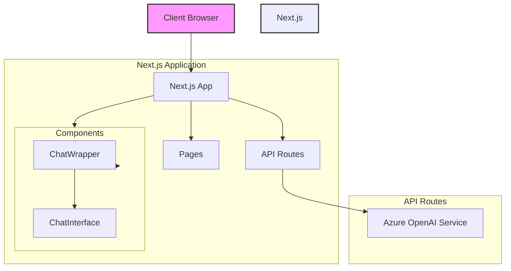
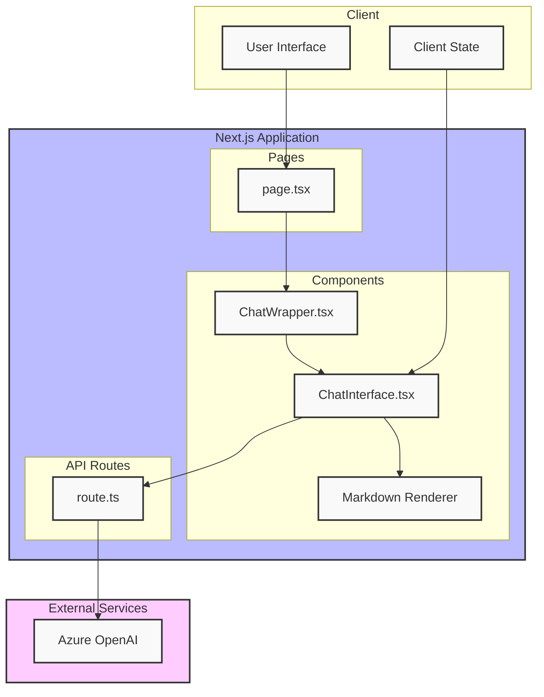

# Next.js Chat Application

このプロジェクトは、Next.js 15.0を使用したモダンなチャットアプリケーションです。Azure OpenAIと連携して、インタラクティブなチャット体験を提供します。

## 機能

- リアルタイムチャットインターフェース
- Markdownサポート（コードブロックの構文強調表示を含む）
- ダークモード対応
- レスポンシブデザイン
- Azure OpenAI APIとの統合
- カスタムフォント（Geist Sans、Geist Mono）の実装
- 日本語入力対応（IME Composition Events）
- テキストエリアの自動リサイズ機能
- エラーハンドリングとタイプセーフな実装

## アーキテクチャ





## 技術スタック

- Next.js 15.0.4
- React 19.0.0
- TypeScript
- Tailwind CSS
  - @tailwindcss/typography プラグイン
- Azure OpenAI API
- react-markdown
- Lucide React（アイコン）
- Vercel AI SDK

## セットアップ手順

1. リポジトリのクローン:
```bash
git clone [repository-url]
cd [project-name]
```

2. 依存関係のインストール:
```bash
npm install
```

3. 環境変数の設定:
`.env.local`ファイルを作成し、以下の変数を設定:
```env
AZURE_OPENAI_API_KEY=your_api_key
AZURE_OPENAI_ENDPOINT=your_endpoint
```

4. 開発サーバーの起動:
```bash
npm run dev
```

## プロジェクト構造

```
.
├── src/
│   ├── app/
│   │   ├── api/
│   │   │   └── chat/
│   │   │       └── route.ts      # Azure OpenAI APIとの通信処理
│   │   ├── fonts/                # カスタムフォントファイル
│   │   │   ├── GeistVF.woff
│   │   │   └── GeistMonoVF.woff
│   │   ├── globals.css          # グローバルスタイル定義
│   │   ├── layout.tsx           # ルートレイアウト（フォント設定含む）
│   │   └── page.tsx             # メインページ
│   ├── components/
│   │   ├── ChatWrapper.tsx      # SSR制御用ラッパー
│   │   └── ChatInterface.tsx    # メインチャットUI
│   └── types/
│       └── chat.ts              # 型定義
├── public/
├── tailwind.config.ts           # Tailwind設定
└── package.json
```

## 主要コンポーネント

### ChatInterface.tsx
- メインのチャットインターフェース
- メッセージの送受信処理
- Markdown表示機能
- 自動スクロール機能
- テキストエリアの自動リサイズ
- IME入力のハンドリング
- キーボードショートカット（Shift + Enter）

### ChatWrapper.tsx
- ChatInterfaceのラッパーコンポーネント
- クライアントサイドレンダリングの制御
- dynamic importによるSSR最適化

### route.ts (API)
- Azure OpenAI APIとの通信
- エラーハンドリング
- ストリーミングレスポンスの実装
- Edge Runtimeでの実行

## スタイリング

このプロジェクトはTailwind CSSを使用しており、以下の機能を含みます：

- カスタムカラーテーマ
  - CSS変数による動的なテーマ切り替え
- ダークモードサポート（system preference対応）
- Typographyプラグイン（Markdown表示用）
- カスタムフォント
  - Geist Sans（本文用）
  - Geist Mono（コードブロック用）

## パフォーマンス最適化

- Edge Runtime使用によるレスポンス時間の短縮
- ストリーミングレスポンスの実装
- Dynamic Importによるコード分割
- 可変フォント（Variable Fonts）の使用

## エラーハンドリング

- API Key/Endpoint未設定時のエラー処理
- OpenAI API通信時のエラー処理
- 型安全な実装によるランタイムエラーの防止

## 開発

1. 新機能の開発:
```bash
git checkout -b feature/your-feature-name
```

2. コードの変更とテスト

3. プルリクエストの作成

## ビルドとデプロイ

プロダクションビルドの作成:
```bash
npm run build
```

ビルドの実行:
```bash
npm run start
```

## 貢献

1. このリポジトリをフォーク
2. 機能ブランチを作成
3. 変更をコミット
4. プルリクエストを作成

## ライセンス

MIT

## 作者

[Your Name]

## 謝辞

- Next.js team
- Vercel
- Azure OpenAI team
- Geist Font team