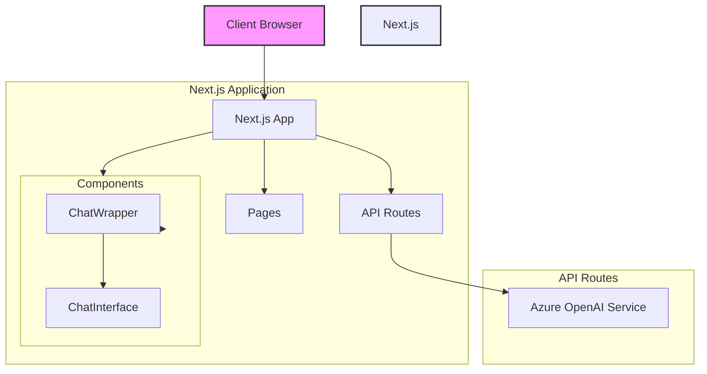
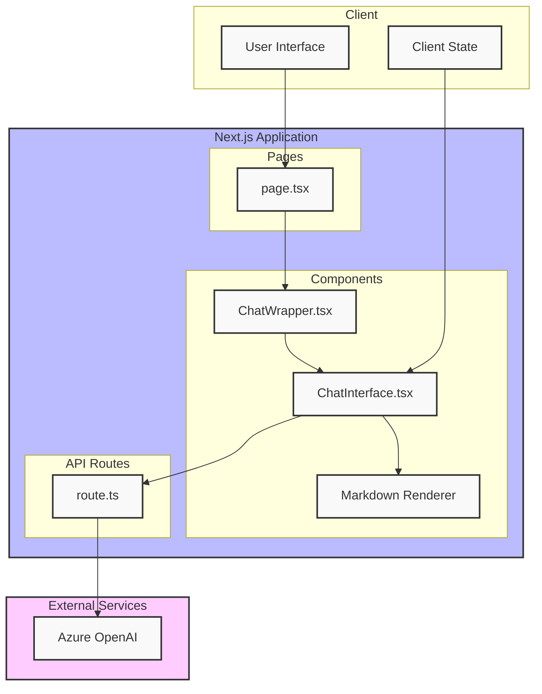

# Next.js Chat Application

このプロジェクトは、Next.js 15.0を使用したモダンなチャットアプリケーションです。Azure OpenAIと連携して、インタラクティブなチャット体験を提供します。

## 機能

- リアルタイムチャットインターフェース
- Markdownサポート（コードブロックの構文強調表示を含む）
- ダークモード対応
- レスポンシブデザイン
- Azure OpenAI APIとの統合
- カスタムフォント（Geist Sans、Geist Mono）の実装
- 日本語入力対応（IME Composition Events）
- テキストエリアの自動リサイズ機能
- エラーハンドリングとタイプセーフな実装

## アーキテクチャ





## 技術スタック

- Next.js 15.0.4
- React 19.0.0
- TypeScript
- Tailwind CSS
  - @tailwindcss/typography プラグイン
- Azure OpenAI API
- react-markdown
- Lucide React（アイコン）
- Vercel AI SDK

## セットアップ手順

1. リポジトリのクローン:
```bash
git clone [repository-url]
cd [project-name]
```

2. 依存関係のインストール:
```bash
npm install
```

3. 環境変数の設定:
`.env.local`ファイルを作成し、以下の変数を設定:
```env
AZURE_OPENAI_API_KEY=your_api_key
AZURE_OPENAI_ENDPOINT=your_endpoint
```

4. 開発サーバーの起動:
```bash
npm run dev
```

## プロジェクト構造

```
.
├── src/
│   ├── app/
│   │   ├── api/
│   │   │   └── chat/
│   │   │       └── route.ts      # Azure OpenAI APIとの通信処理
│   │   ├── fonts/                # カスタムフォントファイル
│   │   │   ├── GeistVF.woff
│   │   │   └── GeistMonoVF.woff
│   │   ├── globals.css          # グローバルスタイル定義
│   │   ├── layout.tsx           # ルートレイアウト（フォント設定含む）
│   │   └── page.tsx             # メインページ
│   ├── components/
│   │   ├── ChatWrapper.tsx      # SSR制御用ラッパー
│   │   └── ChatInterface.tsx    # メインチャットUI
│   └── types/
│       └── chat.ts              # 型定義
├── public/
├── tailwind.config.ts           # Tailwind設定
└── package.json
```

## 主要コンポーネント

### ChatInterface.tsx
- メインのチャットインターフェース
- メッセージの送受信処理
- Markdown表示機能
- 自動スクロール機能
- テキストエリアの自動リサイズ
- IME入力のハンドリング
- キーボードショートカット（Shift + Enter）

### ChatWrapper.tsx
- ChatInterfaceのラッパーコンポーネント
- クライアントサイドレンダリングの制御
- dynamic importによるSSR最適化

### route.ts (API)
- Azure OpenAI APIとの通信
- エラーハンドリング
- ストリーミングレスポンスの実装
- Edge Runtimeでの実行

## スタイリング

このプロジェクトはTailwind CSSを使用しており、以下の機能を含みます：

- カスタムカラーテーマ
  - CSS変数による動的なテーマ切り替え
- ダークモードサポート（system preference対応）
- Typographyプラグイン（Markdown表示用）
- カスタムフォント
  - Geist Sans（本文用）
  - Geist Mono（コードブロック用）

## パフォーマンス最適化

- Edge Runtime使用によるレスポンス時間の短縮
- ストリーミングレスポンスの実装
- Dynamic Importによるコード分割
- 可変フォント（Variable Fonts）の使用

## エラーハンドリング

- API Key/Endpoint未設定時のエラー処理
- OpenAI API通信時のエラー処理
- 型安全な実装によるランタイムエラーの防止


# データベースの初期設定
```bash
npm install mysql2 prisma @prisma/client

# マイグレーション
npx prisma migrate dev


```


## 開発

1. 新機能の開発:
```bash
git checkout -b feature/your-feature-name
```

2. コードの変更とテスト

3. プルリクエストの作成

## ビルドとデプロイ

プロダクションビルドの作成:
```bash
npm run build
```

ビルドの実行:
```bash
npm run start
```


## Dockerでの単体起動

```bash
# コンテナ名を調べる
docker images

# 起動①
docker run -d -p 3000:3000 --name my-nodegpt-container vsc-nodegpt-82276577176aeab8353efc6ac851d59197f77e231551207af512e3af353e20b6:latest


# コンテナにイメージ名をつけて起動しやすくする
docker tag vsc-nodegpt-82276577176aeab8353efc6ac851d59197f77e231551207af512e3af353e20b6:latest vsc-nodegpt:latest
# 起動②:その場合次回からコマンドが短縮になります
docker run -d -p 3000:3000 --name my-nodegpt-container vsc-nodegpt:latest

# 動作を確認するには
docker logs my-nodegpt-container

# コンテナの停止方法
#　まず起動中のコンテナの確認
docker ps
# すると以下のような画面が出るのでCONTAINER IDもしくはNAMESをメモする
CONTAINER ID   IMAGE                  COMMAND                  CREATED          STATUS          PORTS                    NAMES
c27a1d8f910d   vsc-nodegpt:latest     "npm run dev"            3 days ago       Up 2 hours      0.0.0.0:3000->3000/tcp   my-nodegpt-container
# 停止コマンド（IDもしくはNAMESを指定してstop）
docker stop my-nodegpt-container
```
#########################################################

# docker-compose.yaml,devcontainers.jsonによるオーケストレーションを使用して.envで環境変数を一元管理

### 基本概念:以下の設定を各ファイルに追加する
docker-compose.ymlでの設定：
```yaml
services:
  app:
    # ...その他の設定
    env_file:
      - .env
```

devcontainer.jsonでの設定：

```json
{
    // ...その他の設定
    "dockerComposeFile": "docker-compose.yml",
    "service": "app",
    // ...その他の設定
}
```
.envファイルを.gitignoreに追加することで、バージョン管理から除外します。

```gitignore
# .gitignore
.env
```
.envの例
```env
# .env
AZURE_OPENAI_API_KEY=your_azure_openai_api_key
AZURE_OPENAI_ENDPOINT=https://your-endpoint.azure.com/

OPENAI_API_KEY=your_openai_api_key

MYSQL_HOST=qedx-sql.mysql.database.azure.com
MYSQL_USER=qedxroot
MYSQL_PASSWORD=your_password
MYSQL_DATABASE=qedx_ai
PORT=3000

```
# 開発環境と本番環境の分離
### 開発環境:

現在の docker-compose.yml を使用。
VSCode の DevContainer を通じて開発環境を構築。
### 本番環境:

別途本番用の docker-compose.prod.yml を用意。
デプロイ時に docker-compose -f docker-compose.prod.yml up を使用して本番環境を構築。

### 本番環境用の docker-compose.prod.yml のビルドと起動
1. 本番環境用イメージのビルド。まず、本番環境用のイメージをビルドします：

```bash
docker compose -f docker-compose.prod.yml build

# macで上記のコマンドを時効する前にplatformがlinux/amd64になっているかを確認。
# services:
#   app:
#     platform: linux/amd64  # サービスレベルでプラットフォームを指定
```

2. 本番環境用コンテナの起動:ビルドが完了したら、本番環境用コンテナを起動します：

```bash
docker compose -f docker-compose.prod.yml up -d
```
3. 本番環境用コンテナの確認
正常に起動しているか確認します：

```bash
docker compose -f docker-compose.prod.yml ps
```

# ACR(Azure Container Registory)へのコンテナ登録
- azureportalでACRのリソースを作ってきます
- adminアカウントを作ると、ioサーバ名、ユーザー名、パスワードがもらえます
```bash
docker login teamsbotdocker.azurecr.io
#user,passを入力。passのコピペが難しいので注意

# 既存のプロダクトコンテナの確認(IMAGEのところに注目)
docker compose -f docker-compose.prod.yml ps


# 既存イメージをACR用にタグ付けする
docker tag nodegpt-app teamsbotdocker.azurecr.io/nodegpt-app:latest


# タグ付けしたイメージをACRにプッシュする
docker push teamsbotdocker.azurecr.io/nodegpt-app:latest

# pullもできる
docker pull myregistry.azurecr.io/hello-world

```

# コンテナからのデプロイ（azure app service）

- とりあえず、githubからのオートデプロイは明日設定。
- 環境変数はコンテナに入ってないので、app service側で設定すること（vscodeの拡張機能で.envをアップロードするのが楽です）
- ソースをgithubのコードではなくコンテナと設定する。
- スタートアップコマンドは必要なかった

# エラー対応
- devcontainerが急に開けなくなったりしたらエラー不足？
```bash
# 未使用のコンテナ、イメージ、ボリューム、ネットワークを削除
docker system prune -a --volumes
docker system df
```

# git cloneしてからのdev container入るまで
```bash
# 環境のめも
#　node20LTS,(node22LTSはdevcontainer入れなかった)
# docker最新版
# WSLをUbuntu22LTSをdockerに連携させた。

#　まず依存関係のインストール
npm install

# dev環境のrun
npm run dev

# 本番環境のビルド
npm run build

# 本番環境のrun
npm run start

#ここまでやったら一度フォルダを閉じて「コンテナで開く」


```


## 貢献

1. このリポジトリをフォーク
2. 機能ブランチを作成
3. 変更をコミット
4. プルリクエストを作成

## ライセンス

MIT

## 作者

[Your Name]

## 謝辞

- Next.js team
- Vercel
- Azure OpenAI team
- Geist Font team