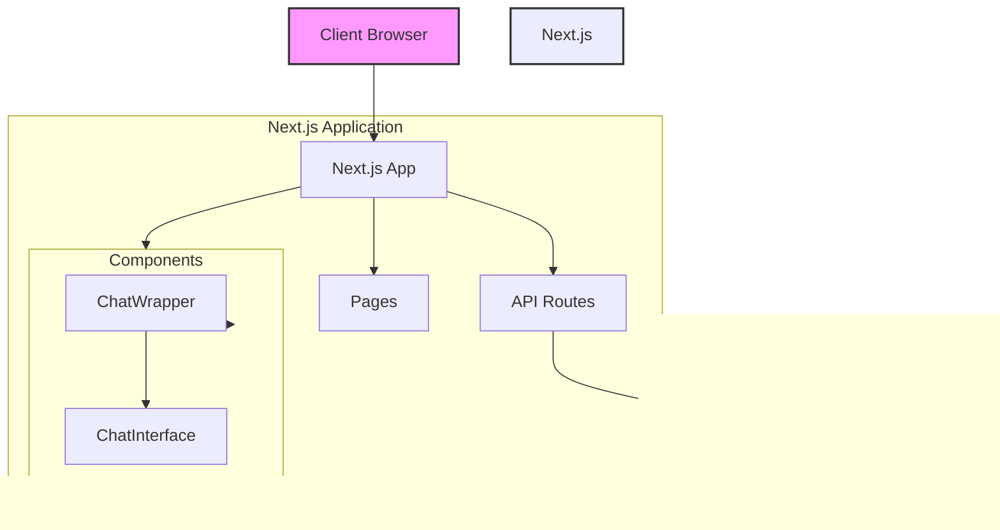

# Next.js Chat Application

このプロジェクトは、Next.js 15.0を使用したモダンなチャットアプリケーションです。Azure OpenAIと連携して、インタラクティブなチャット体験を提供します。

## 機能

- リアルタイムチャットインターフェース
- Markdownサポート（コードブロックの構文強調表示を含む）
- ダークモード対応
- レスポンシブデザイン
- Azure OpenAI APIとの統合

## アーキテクチャ




## 技術スタック

- Next.js 15.0.4
- React 19.0.0
- TypeScript
- Tailwind CSS
- Azure OpenAI API
- react-markdown

## セットアップ手順

1. リポジトリのクローン:
```bash
git clone [repository-url]
cd [project-name]
```

2. 依存関係のインストール:
```bash
npm install
```

3. 環境変数の設定:
`.env.local`ファイルを作成し、以下の変数を設定:
```env
AZURE_OPENAI_API_KEY=your_api_key
AZURE_OPENAI_ENDPOINT=your_endpoint
```

4. 開発サーバーの起動:
```bash
npm run dev
```

## プロジェクト構造

```
.
├── src/
│   ├── app/
│   │   ├── api/
│   │   │   └── chat/
│   │   │       └── route.ts
│   │   ├── globals.css
│   │   ├── layout.tsx
│   │   └── page.tsx
│   └── components/
│       ├── ChatWrapper.tsx
│       └── ChatInterface.tsx
├── public/
├── tailwind.config.ts
└── package.json
```

## 主要コンポーネント

### ChatInterface.tsx
- メインのチャットインターフェース
- メッセージの送受信処理
- Markdown表示機能
- 自動スクロール機能

### ChatWrapper.tsx
- ChatInterfaceのラッパーコンポーネント
- クライアントサイドレンダリングの制御

## スタイリング

このプロジェクトはTailwind CSSを使用しており、以下の機能を含みます：

- カスタムカラーテーマ
- ダークモードサポート
- Typographyプラグイン（Markdown表示用）

## 開発

1. 新機能の開発:
```bash
git checkout -b feature/your-feature-name
```

2. コードの変更とテスト

3. プルリクエストの作成

## ビルドとデプロイ

プロダクションビルドの作成:
```bash
npm run build
```

ビルドの実行:
```bash
npm run start
```

## 貢献

1. このリポジトリをフォーク
2. 機能ブランチを作成
3. 変更をコミット
4. プルリクエストを作成

## ライセンス

MIT

## 作者

[Your Name]

## 謝辞

- Next.js team
- Vercel
- Azure OpenAI team


